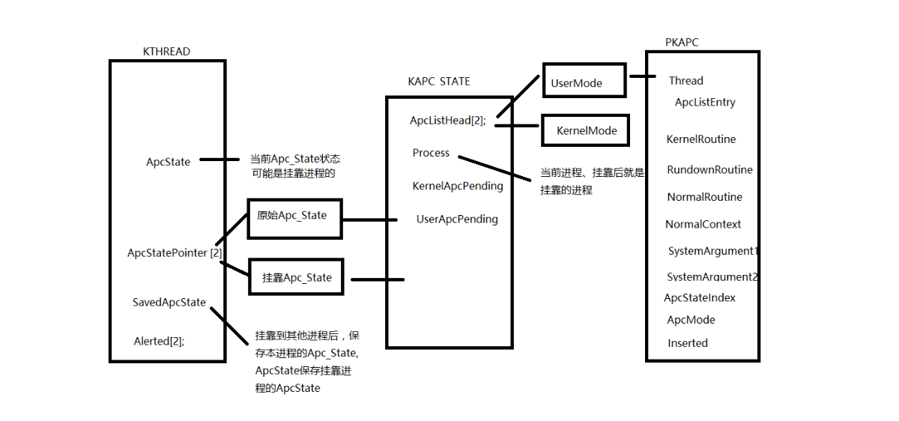
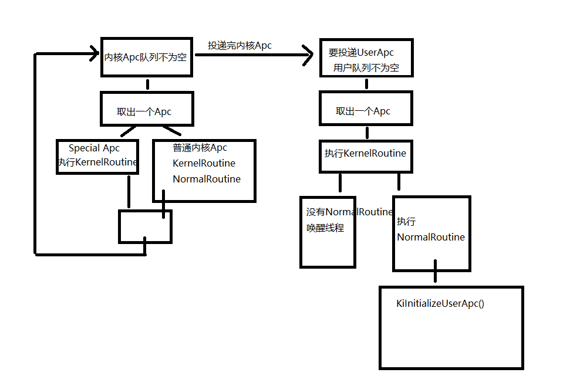
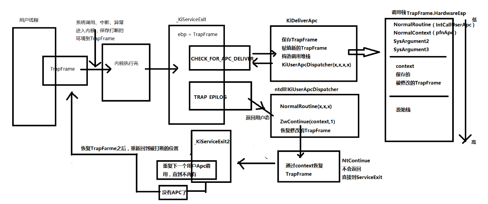
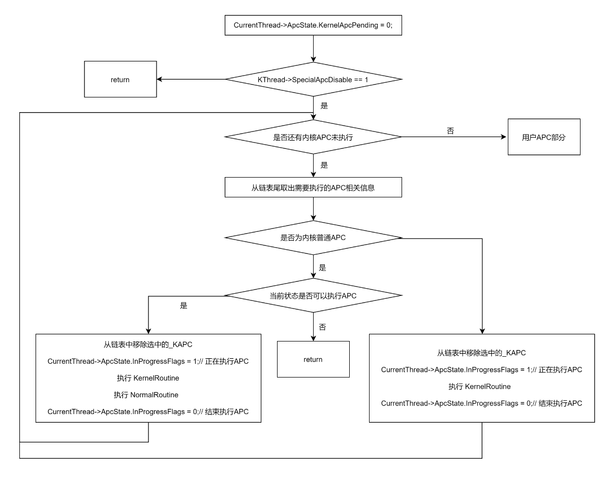
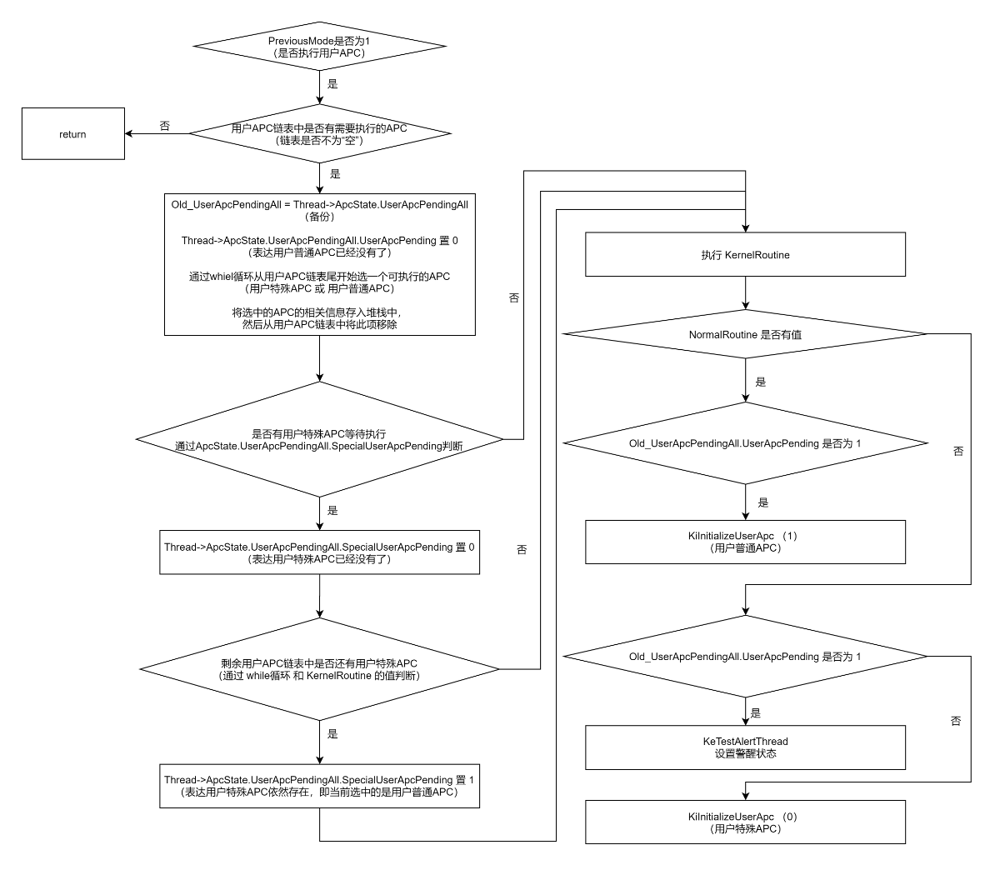

# windows APC 机制
从概念，应用和原理三个方面简单阐述APC
## 概念
### APC是什么
* APC英文全称**Asyncroneus Procedure Call**，即异步过程调用
### 为什么会有APC
* 线程是不能被“杀掉”、“挂起”、“恢复”的，线程在执行的时候自己占据着CPU，其他线程是不能改变
其行为。如果想改变一个线程的行为，可以给他提供一个函数，让它自己去调用。这个就是APC

## 应用
### R3向线程插入APC
1. 先定义一个apc回调函数
2. 获取目标线程的句柄
3. 调用QueueUserAPC将APC插入队列
4. 注意点： 
   * 标线程必须处于"可警告"状态才能执行APC,比如调用了SleepEx、WaitForSingleObjectEx等函数
   * APC函数在目标线程的上下文中执行
   * 当目标线程结束时,未处理的APC会被丢弃

### SuspendThread使用APC挂起线程
SuspendThread逆向分析:
调用链：
SuspendThread -> NtSuspendThread -> PsSuspendThread -> KeSuspendThread

Windows-Server-2003的KeSuspendThread源码：
```cpp
ULONG
KeSuspendThread (IN PKTHREAD Thread)
{
    KLOCK_QUEUE_HANDLE LockHandle;
    ULONG OldCount;

    KeAcquireInStackQueuedSpinLockRaiseToSynch(&Thread->ApcQueueLock, &LockHandle);

    OldCount = Thread->SuspendCount;
    if (OldCount == MAXIMUM_SUSPEND_COUNT) {
        KeReleaseInStackQueuedSpinLock(&LockHandle);
        ExRaiseStatus(STATUS_SUSPEND_COUNT_EXCEEDED);
    }

    if (Thread->ApcQueueable == TRUE) {
        Thread->SuspendCount += 1;
        if ((OldCount == 0) && (Thread->FreezeCount == 0)) {
            if (Thread->SuspendApc.Inserted == TRUE) {
                KiLockDispatcherDatabaseAtSynchLevel();
                Thread->SuspendSemaphore.Header.SignalState -= 1;
                KiUnlockDispatcherDatabaseFromSynchLevel();

            } else {
                Thread->SuspendApc.Inserted = TRUE;
                // 这里就是插入APC队列
                KiInsertQueueApc(&Thread->SuspendApc, RESUME_INCREMENT);
            }
        }
    }

    KeReleaseInStackQueuedSpinLockFromDpcLevel(&LockHandle);
    KiExitDispatcher(LockHandle.OldIrql);
    return OldCount;
}
```


可以分析TerminateThread函数，也是使用apc结束线程。

## 原理

### KTHREAD结构体中与APC相关的内容
```cpp
kd> dt _KTHREAD
nt!_KTHREAD
    ...
    +0x034 ApcState         : _KAPC_STATE
    ...
    +0x138 ApcStatePointer  : [2] Ptr32 _KAPC_STATE
    ...
    +0x14c SavedApcState    : _KAPC_STATE
    ...
    +0x165 ApcStateIndex    : UChar
    +0x166 ApcQueueable     : UChar
    ...
```

#### ApcState(APC队列)
```cpp
kd> dt _KAPC_STATE
ntdll!_KAPC_STATE
   +0x000 ApcListHead      : [2] _LIST_ENTRY
   +0x010 Process          : Ptr32 _KPROCESS
   +0x014 KernelApcInProgress : UChar
   +0x015 KernelApcPending : UChar
   +0x016 UserApcPending   : UChar
```
* ApcListHead: 由两个双向链表组成。一个是用户的APC，一个是内核的APC
* Process：指向线程所属或者挂靠进程
* KernelApcInProgress：内核Apc是否正在执行
* KernelApcPending：是否存在等待状态的内核APC，存在则置1
* UserApcPending：是否存在等待状态的用户APC，存在则置1

#### SavedApcState(备用APC队列)
为啥会有个这个？
1. 线程APC队列中的APC函数都是与进程相关联的，一个进程的线程中所有APC函数，要访问的内存地址都是A进程的。
2. 当A进程的线程T，挂靠到B进程时。将T原有APC队列保存在SavedApcState中，并将B进程相关的APC函数设置到ApcState中。这样就避免了APC函数访问到错误的进程地址空间。

#### ApcStatePointer
指针数组：包含ApcState和SavedApcState两个成员。

#### ApcStateIndex
四个值：
* 0: 原始环境
* 1: 挂靠环境
* 2: 当前环境
* 3: 插入APC时的当前环境

ApcStatePointer 与 ApcStateIndex 组合寻址:
   *  正常情况下，向ApcState队列中插入APC时,ApcStatePointer[0]指向ApcState，此时ApcStateIndex的值为0，ApcStatePointer[ApcStateIndex]指向ApcState。
   *  挂靠情况下，向ApcState队列中插入APC时，ApcStatePointer[1]指向ApcState，此时ApcStateIndex的值为1，ApcStatePointer[ApcStateIndex]指向ApcState。
  
**ApcStatePointer[ApcStateIndex]指向的都是ApcState，也就是该值总是表示线程当前使用的APC状态**。

#### ApcQueueable
 用于表示是否可以向线程的APC队列中插入APC

#### 分析NtReadVirtualMemory在挂靠时如何备份和恢复APC队列
```cpp
NTSTATUS
NtReadVirtualMemory (
     IN HANDLE ProcessHandle,
     IN PVOID BaseAddress,
     OUT PVOID Buffer,
     IN SIZE_T BufferSize,
     OUT PSIZE_T NumberOfBytesRead OPTIONAL
     )
{
   ...
   ...
    BytesCopied = 0;
    Status = STATUS_SUCCESS;
    if (BufferSize != 0) {
        Status = ObReferenceObjectByHandle(ProcessHandle,
                                           PROCESS_VM_READ,
                                           PsProcessType,
                                           PreviousMode,
                                           (PVOID *)&Process,
                                           NULL);
        if (Status == STATUS_SUCCESS) {

            Status = MmCopyVirtualMemory (Process,
                                          BaseAddress,
                                          PsGetCurrentProcessByThread(CurrentThread),
                                          Buffer,
                                          BufferSize,
                                          PreviousMode,
                                          &BytesCopied);

            ObDereferenceObject(Process);
        }
    }
   ...
   ...
   return Status;
}
```
NtReadVirtualMemory的函数实现内存拷贝是通过MmCopyVirtualMemory这个函数实现

```cpp
NTSTATUS
MmCopyVirtualMemory(
    IN PEPROCESS FromProcess,
    IN CONST VOID *FromAddress,
    IN PEPROCESS ToProcess,
    OUT PVOID ToAddress,
    IN SIZE_T BufferSize,
    IN KPROCESSOR_MODE PreviousMode,
    OUT PSIZE_T NumberOfBytesCopied
    )
{
   ...
   ...
   if (BufferSize > POOL_MOVE_THRESHOLD) {
      Status = MiDoMappedCopy(FromProcess,
                              FromAddress,
                              ToProcess,
                              ToAddress,
                              BufferSize,
                              PreviousMode,
                              NumberOfBytesCopied);

      if (Status != STATUS_WORKING_SET_QUOTA) {
         goto CompleteService;
      }

      *NumberOfBytesCopied = 0;
   }
    ...
    ...
    return Status;
}
```
继续跟踪MiDoMappedCopy函数：

```cpp
NTSTATUS
MiDoMappedCopy (
    IN PEPROCESS FromProcess,
    IN CONST VOID *FromAddress,
    IN PEPROCESS ToProcess,
    OUT PVOID ToAddress,
    IN SIZE_T BufferSize,
    IN KPROCESSOR_MODE PreviousMode,
    OUT PSIZE_T NumberOfBytesRead
    )
{
   ...
   KeStackAttachProcess (&FromProcess->Pcb, &ApcState);
   ...
   KeUnstackDetachProcess (&ApcState);
   ...
   ...
}
```
经过分析，发现与APC备份恢复的都是在进程挂靠相关函数上：KeStackAttachProcess和KeUnstackDetachProcess

KeStackAttachProcess函数源码:
```cpp
KeStackAttachProcess (
    IN PRKPROCESS Process,
    OUT PRKAPC_STATE ApcState
    )
{

    KLOCK_QUEUE_HANDLE LockHandle;
    PRKTHREAD Thread;

    ASSERT_PROCESS(Process);
    ASSERT(KeGetCurrentIrql() <= DISPATCH_LEVEL);

    Thread = KeGetCurrentThread();
    if (KeIsExecutingDpc() != FALSE) {
        KeBugCheckEx(INVALID_PROCESS_ATTACH_ATTEMPT,
                     (ULONG_PTR)Process,
                     (ULONG_PTR)Thread->ApcState.Process,
                     (ULONG)Thread->ApcStateIndex,
                     (ULONG)KeIsExecutingDpc());
    }

    if (Thread->ApcState.Process == Process) {
        ApcState->Process = (PRKPROCESS)1;

    } else {

        KeAcquireInStackQueuedSpinLockRaiseToSynch(&Thread->ApcQueueLock,
                                                   &LockHandle);

        KiLockDispatcherDatabaseAtSynchLevel();

        if (Thread->ApcStateIndex != 0) { // 线程处于正常情况
            KiAttachProcess(Thread, Process, &LockHandle, ApcState);

        } else { // 线程处于挂靠情况
            KiAttachProcess(Thread, Process, &LockHandle, &Thread->SavedApcState);
            ApcState->Process = NULL;
        }
    }

    return;
}
```
继续往下看KiAttachProcess的函数源码：
```cpp
VOID KiAttachProcess (
    IN PRKTHREAD Thread,
    IN PKPROCESS Process,
    IN PKLOCK_QUEUE_HANDLE LockHandle,
    OUT PRKAPC_STATE SavedApcState
    )
{
   ...
   Thread->ApcState.KernelApcInProgress = FALSE;
   Thread->ApcState.KernelApcPending  = FALSE;
   Thread->ApcState.UserApcPending = FALSE;
   if (SavedApcState == &Thread->SavedApcState) {
      Thread->ApcStatePointer[0] = &Thread->SavedApcState;
      Thread->ApcStatePointer[1] = &Thread->ApcState;
      Thread->ApcStateIndex = 1;
   }
   ...
   return;
}
```
里面这段就是apc备份的代码：
```cpp
if ( ApcState == &thread->SavedApcState )
  {
    thread->ApcStatePointer[0] = &thread->SavedApcState;
    thread->ApcStatePointer[1] = &thread->ApcState;
    thread->ApcStateIndex = 1; // 值为1则为挂靠状态
  }
```
可以看到 ApcStatePointer[ApcStateIndex] 指向的都是当前线程使用的ApcState。

继续看KeUnstackDetachProcess代码：
```cpp
VOID
KeUnstackDetachProcess (
    IN PRKAPC_STATE ApcState
    )
{
   ...
      Process = Thread->ApcState.Process;
      KiLockDispatcherDatabaseAtSynchLevel();
      Process->StackCount -= 1;
      if ((Process->StackCount == 0) &&
         (IsListEmpty(&Process->ThreadListHead) == FALSE)) {
         Process->State = ProcessOutTransition;
         InterlockedPushEntrySingleList(&KiProcessOutSwapListHead,
                                          &Process->SwapListEntry);

         KiSetInternalEvent(&KiSwapEvent, KiSwappingThread);
      }

      KiUnlockDispatcherDatabaseFromSynchLevel();


      if (ApcState->Process != NULL) {
         KiMoveApcState(ApcState, &Thread->ApcState);

      } else {
         KiMoveApcState(&Thread->SavedApcState, &Thread->ApcState);
         Thread->SavedApcState.Process = (PKPROCESS)NULL;
         Thread->ApcStatePointer[0] = &Thread->ApcState;
         Thread->ApcStatePointer[1] = &Thread->SavedApcState;
         Thread->ApcStateIndex = 0;
      }
      ...
   return;
}

```
可以看到这段代码：
```cpp
if (ApcState->Process != NULL) {
   KiMoveApcState(ApcState, &Thread->ApcState);
} else {
   KiMoveApcState(&Thread->SavedApcState, &Thread->ApcState);
   Thread->SavedApcState.Process = (PKPROCESS)NULL;
   Thread->ApcStatePointer[0] = &Thread->ApcState;
   Thread->ApcStatePointer[1] = &Thread->SavedApcState;
   Thread->ApcStateIndex = 0; //值为0为非挂靠状态
}
```

### KAPC结构体
管是内核APC还是用户APC，内核都要准备一个KAPC的数据结构，并且将这个KAPC结构挂到相应的APC队列中。
```cpp
kd> dt _KAPC
ntdll!_KAPC
   +0x000 Type             : Int2B                 // 类型：APC对象
   +0x002 Size             : Int2B                 // APC结构体大小
   +0x004 Spare0           : Uint4B                // 
   +0x008 Thread           : Ptr32 _KTHREAD        // 当前线程的KTHREAD
   +0x00c ApcListEntry     : _LIST_ENTRY           // 当前线程的APC链表
   +0x014 KernelRoutine    : Ptr32     void 
   +0x018 RundownRoutine   : Ptr32     void 
   +0x01c NormalRoutine    : Ptr32     void 
   +0x020 NormalContext    : Ptr32 Void            // 用户定义的Apc函数
   +0x024 SystemArgument1  : Ptr32 Void            // 用户Apc函数的参数
   +0x028 SystemArgument2  : Ptr32 Void 
   +0x02c ApcStateIndex    : Char                  // Apc状态
   +0x02d ApcMode          : Char                  // Apc所处的Mode
   +0x02e Inserted         : UChar                 //是否已经被插入队列

```
* Thread：指向目标线程的线程结构体的指针，因为任何一个APC都是让目标线程进行完成
* ApcListEntry： APC队列挂的位置
* NormalRoutine：存储着用户APC总入口或真正的内核APC函数地址
* NormalContext：当为内核APC，该成员为NULL；如果为用户APC，则为真正的APC函数。
* ApcMode:指示该APC是内核APC还是用户APC
* Inserted:表示本APC是否已挂入队列。挂入前值为0，挂入后值为1。

### APC插入过程分析（QueueUserAPC逆向分析）
QueueUserAPC -> NtQueueApcThread -> KeInitializeApc -> KeInsertQueueApc -> KiInsertQueueApc
QueueUserAPC:
```cpp
WINBASEAPI DWORD WINAPI QueueUserAPC(
    PAPCFUNC pfnAPC,       // APC函数指针
    HANDLE hThread,        // 需要插入APC的线程的句柄
    ULONG_PTR dwData       // 传递给APC函数的参数
    )
{
    ...
    NTSTATUS Status = NtQueueApcThread(
                hThread,
                (PPS_APC_ROUTINE)BaseDispatchAPC,
                (PVOID)pfnAPC,
                (PVOID)dwData,
                NULL
                );
    ...
}
```
可以看到QueueUserAPC的核心就是调用了NtQueueApcThread。其中需要注意的是第二个参数BaseDispatchAPC。其实现如下：
```cpp
VOID
BaseDispatchAPC(
    LPVOID lpApcArgument1,    // APC函数指针
    LPVOID lpApcArgument2,    // 传递给APC函数的参数
    LPVOID lpApcArgument3
    )
{
    PAPCFUNC pfnAPC = (PAPCFUNC)lpApcArgument1;
    ULONG_PTR dwData = (ULONG_PTR)lpApcArgument2;
    (pfnAPC)(dwData);
}
```
BaseDispatchAPC是派发APC执行的函数。然后继续看NtQueueApcThread:

```cpp
NTSYSAPI NTSTATUS NTAPI NtQueueApcThread(
    IN HANDLE ThreadHandle, 
    IN PPS_APC_ROUTINE ApcRoutine,
    IN PVOID ApcArgument1,      // APC函数
    IN PVOID ApcArgument2,      // APC函数的参数
    IN PVOID ApcArgument3       // NULL
    )
{
    ...

    PKAPC  Apc = ExAllocatePoolWithQuotaTag (
                        NonPagedPool | POOL_QUOTA_FAIL_INSTEAD_OF_RAISE,
                        sizeof(*Apc),
                        'pasP');
    
    ...

    KeInitializeApc(Apc,  
                    &Thread->Tcb,
                    OriginalApcEnvironment,
                    PspQueueApcSpecialApc,
                    NULL,
                    (PKNORMAL_ROUTINE)ApcRoutine,
                    UserMode,
                    ApcArgument1);    // 初始化结构体

    if (!KeInsertQueueApc(Apc, ApcArgument2, ApcArgument3, 0)) // 插入APC
    { 
        ExFreePool (Apc);
    }

    ...
}

```
其中可以看到KeInitializeApc：初始化APC；KeInsertQueueApc：插入APC
```cpp
VOID KeInitializeApc (
    IN PRKAPC Apc,
    IN PRKTHREAD Thread,
    IN KAPC_ENVIRONMENT Environment,
    IN PKKERNEL_ROUTINE KernelRoutine,
    IN PKRUNDOWN_ROUTINE RundownRoutine OPTIONAL,
    IN PKNORMAL_ROUTINE NormalRoutine OPTIONAL,
    IN KPROCESSOR_MODE ApcMode OPTIONAL, 
    IN PVOID NormalContext OPTIONAL
    )
{

    Apc->Type = ApcObject;
    Apc->Size = sizeof(KAPC);

    if (Environment == CurrentApcEnvironment) {
        Apc->ApcStateIndex = Thread->ApcStateIndex;
    } else {
        ASSERT((Environment <= Thread->ApcStateIndex) || (Environment == InsertApcEnvironment));
        Apc->ApcStateIndex = (CCHAR)Environment;
    }

    Apc->Thread = Thread;
    Apc->KernelRoutine = KernelRoutine;
    Apc->RundownRoutine = RundownRoutine;
    Apc->NormalRoutine = NormalRoutine;   // PspQueueApcSpecialApc，用于释放APC对象
    if (ARGUMENT_PRESENT(NormalRoutine)) {
        Apc->ApcMode = ApcMode;
        Apc->NormalContext = NormalContext;
    } else {
        Apc->ApcMode = KernelMode;
        Apc->NormalContext = NIL;
    }

    Apc->Inserted = FALSE;
    return;
}
```
需要注意APC结构体的这三个成员的初始化：
* NormalRoutine：存储着用户APC总入口或真正的内核APC函数地址
* NormalContext：当为内核APC，该成员为NULL；如果为用户APC，则为真正的APC函数。
* ApcMode:指示该APC是内核APC还是用户APC
* ApcStateIndex：
  * OriginalApcEnvironment（0）：
  * AttachedApcEnvironment（1）：
  * CurrentApcEnvironment（2）：
  * InsertApcEnvironment（3）：

再来看KeInsertQueueApc:
```cpp
BOOLEAN KeInsertQueueApc (
    IN PRKAPC Apc,
    IN PVOID SystemArgument1,   // apc参数
    IN PVOID SystemArgument2,   // NULL
    IN KPRIORITY Increment
    )
{
    ... 
    Apc->Inserted = TRUE;
    Apc->SystemArgument1 = SystemArgument1;
    Apc->SystemArgument2 = SystemArgument2;
    KiInsertQueueApc(Apc, Increment);
    ...
}
```
KeInsertQueueApc中加锁的代码被省略了，其核心就是KiInsertQueueApc。KiInsertQueueApc函数功能就是将APC插入线程的APC队列：
```cpp
VOID FASTCALL KiInsertQueueApc (
    IN PKAPC InApc,
    IN KPRIORITY Increment
    )
{
    ...
    PKAPC Apc = InApc;

    Thread = Apc->Thread;
    if (Apc->ApcStateIndex == InsertApcEnvironment) {
        Apc->ApcStateIndex = Thread->ApcStateIndex;
    }

    ApcState = Thread->ApcStatePointer[Apc->ApcStateIndex];

    ApcMode = Apc->ApcMode;

    ASSERT (Apc->Inserted == TRUE);

    // 注意这里不同APC插入到APC队列的位置不一样
    if (Apc->NormalRoutine != NULL) {
        if ((ApcMode != KernelMode) && (Apc->KernelRoutine == PsExitSpecialApc)) {
            Thread->ApcState.UserApcPending = TRUE;
            InsertHeadList(&ApcState->ApcListHead[ApcMode],
                           &Apc->ApcListEntry);
        } else {
            InsertTailList(&ApcState->ApcListHead[ApcMode],
                           &Apc->ApcListEntry);
        }
    } else {
        ListEntry = ApcState->ApcListHead[ApcMode].Blink;
        while (ListEntry != &ApcState->ApcListHead[ApcMode]) {
            ApcEntry = CONTAINING_RECORD(ListEntry, KAPC, ApcListEntry);
            if (ApcEntry->NormalRoutine == NULL) {
                break;
            }

            ListEntry = ListEntry->Blink;
        }

        InsertHeadList(ListEntry, &Apc->ApcListEntry);
    }

    if (Apc->ApcStateIndex == Thread->ApcStateIndex) {
        KiLockDispatcherDatabaseAtSynchLevel();
        if (ApcMode == KernelMode) {
            ASSERT((Thread != KeGetCurrentThread()) || (Thread->State == Running));

            KeMemoryBarrier();
            Thread->ApcState.KernelApcPending = TRUE;
            KeMemoryBarrier();
            ThreadState = Thread->State;
            if (ThreadState == Running) {
                KiRequestApcInterrupt(Thread->NextProcessor);

            } else if ((ThreadState == Waiting) &&
                       (Thread->WaitIrql == 0) &&
                       (Thread->SpecialApcDisable == 0) &&
                       ((Apc->NormalRoutine == NULL) ||
                        ((Thread->KernelApcDisable == 0) &&
                         (Thread->ApcState.KernelApcInProgress == FALSE)))) {

                KiUnwaitThread(Thread, STATUS_KERNEL_APC, Increment);
            }

        } else if ((Thread->State == Waiting) &&
                  (Thread->WaitMode == UserMode) &&
                  (Thread->Alertable || Thread->ApcState.UserApcPending)) {

            Thread->ApcState.UserApcPending = TRUE;
            KiUnwaitThread(Thread, STATUS_USER_APC, Increment);
        }
        KiUnlockDispatcherDatabaseFromSynchLevel();
    }
    return;
}
```
KTHREAD, PKAPC，KAPC_STATE。相关结构图：



### APC调用过程分析（KiDeliverApc逆向分析）
KiDeliverApc函数：
```cpp
VOID
KiDeliverApc (
    IN KPROCESSOR_MODE PreviousMode,
    IN PKEXCEPTION_FRAME ExceptionFrame,
    IN PKTRAP_FRAME TrapFrame
    )
{
    // If the thread was interrupted in the middle of the SLIST pop code,
    // then back up the PC to the start of the SLIST pop. 

    if (TrapFrame != NULL) 
    {
#if defined(_AMD64_)

        if ((TrapFrame->Rip >= (ULONG64)&ExpInterlockedPopEntrySListResume) &&
            (TrapFrame->Rip <= (ULONG64)&ExpInterlockedPopEntrySListEnd)) {

            TrapFrame->Rip = (ULONG64)&ExpInterlockedPopEntrySListResume;
        }

#elif defined(_IA64_)

        ULONG64 PC;
        ULONG64 NewPC;

        // Add the slot number so we do the right thing for the instruction
        // group containing the interlocked compare exchange.

        PC = TrapFrame->StIIP + ((TrapFrame->StIPSR & IPSR_RI_MASK) >> PSR_RI);
        NewPC = (ULONG64)((PPLABEL_DESCRIPTOR)(ULONG_PTR)ExpInterlockedPopEntrySListResume)->EntryPoint;
        if ((PC >= NewPC) &&
            (PC <= (ULONG64)((PPLABEL_DESCRIPTOR)(ULONG_PTR)ExpInterlockedPopEntrySListEnd)->EntryPoint)) {

            TrapFrame->StIIP = NewPC;
            TrapFrame->StIPSR &= ~IPSR_RI_MASK;
        }

#elif defined(_X86_)

        if ((TrapFrame->Eip >= (ULONG)&ExpInterlockedPopEntrySListResume) &&
            (TrapFrame->Eip <= (ULONG)&ExpInterlockedPopEntrySListEnd)) {

            TrapFrame->Eip = (ULONG)&ExpInterlockedPopEntrySListResume;
        }

#else
#error "No Target Architecture"
#endif
    }

    // Save the current thread trap frame address and set the thread trap
    // frame address to the new trap frame. This will prevent a user mode
    // exception from being raised within an APC routine.

    Thread = KeGetCurrentThread();
    OldTrapFrame = Thread->TrapFrame;
    Thread->TrapFrame = TrapFrame;

    // If special APC are not disabled, then attempt to deliver one or more
    // APCs.

    Process = Thread->ApcState.Process;
    Thread->ApcState.KernelApcPending = FALSE;
    if (Thread->SpecialApcDisable == 0) 
    {

        // If the kernel APC queue is not empty, then attempt to deliver a
        // kernel APC.
        //
        // N.B. The following test is not synchronized with the APC insertion
        //      code. However, when an APC is inserted in the kernel queue of
        //      a running thread an APC interrupt is requested. Therefore, if
        //      the following test were to falsely return that the kernel APC
        //      queue was empty, an APC interrupt would immediately cause this
        //      code to be executed a second time in which case the kernel APC
        //      queue would found to contain an entry.

        KeMemoryBarrier();
        while (IsListEmpty(&Thread->ApcState.ApcListHead[KernelMode]) == FALSE) 
        {

            // Raise IRQL to dispatcher level, lock the APC queue, and check
            // if any kernel mode APC's can be delivered.

            KeAcquireInStackQueuedSpinLock(&Thread->ApcQueueLock, &LockHandle);

            // If the kernel APC queue is now empty because of the removal of
            // one or more entries, then release the APC lock, and attempt to
            // deliver a user APC.

            NextEntry = Thread->ApcState.ApcListHead[KernelMode].Flink;
            if (NextEntry == &Thread->ApcState.ApcListHead[KernelMode]) {
                KeReleaseInStackQueuedSpinLock(&LockHandle);
                break;
            }

            // Get the address of the APC object and determine the type of
            // APC.

            Apc = CONTAINING_RECORD(NextEntry, KAPC, ApcListEntry);
            KernelRoutine = Apc->KernelRoutine;
            NormalRoutine = Apc->NormalRoutine;
            NormalContext = Apc->NormalContext;
            SystemArgument1 = Apc->SystemArgument1;
            SystemArgument2 = Apc->SystemArgument2;
            if (NormalRoutine == (PKNORMAL_ROUTINE)NULL) {
    
                // First entry in the kernel APC queue is a special kernel APC.
                // Remove the entry from the APC queue, set its inserted state
                // to FALSE, release dispatcher database lock, and call the kernel
                // routine. On return raise IRQL to dispatcher level and lock
                // dispatcher database lock.
    
                RemoveEntryList(NextEntry);
                Apc->Inserted = FALSE;
                KeReleaseInStackQueuedSpinLock(&LockHandle);
                (KernelRoutine)(Apc,
                                &NormalRoutine,
                                &NormalContext,
                                &SystemArgument1,
                                &SystemArgument2);
    


            } else {
                // First entry in the kernel APC queue is a normal kernel APC.
                // If there is not a normal kernel APC in progress and kernel
                // APC's are not disabled, then remove the entry from the APC
                // queue, set its inserted state to FALSE, release the APC queue
                // lock, call the specified kernel routine, set kernel APC in
                // progress, lower the IRQL to zero, and call the normal kernel
                // APC routine. On return raise IRQL to dispatcher level, lock
                // the APC queue, and clear kernel APC in progress.
                if ((Thread->ApcState.KernelApcInProgress == FALSE) &&
                   (Thread->KernelApcDisable == 0)) {

                    RemoveEntryList(NextEntry);
                    Apc->Inserted = FALSE;
                    KeReleaseInStackQueuedSpinLock(&LockHandle);
                    (KernelRoutine)(Apc,
                                    &NormalRoutine,
                                    &NormalContext,
                                    &SystemArgument1,
                                    &SystemArgument2);
    

    
                    if (NormalRoutine != (PKNORMAL_ROUTINE)NULL) {
                        Thread->ApcState.KernelApcInProgress = TRUE;
                        KeLowerIrql(0);
                        (NormalRoutine)(NormalContext,
                                        SystemArgument1,
                                        SystemArgument2);
    
                        KeRaiseIrql(APC_LEVEL, &LockHandle.OldIrql);
                    }
    
                    Thread->ApcState.KernelApcInProgress = FALSE;
    
                } else {
                    KeReleaseInStackQueuedSpinLock(&LockHandle);
                    goto CheckProcess;
                }
            }
        }
        // Kernel APC queue is empty. If the previous mode is user, user APC
        // pending is set, and the user APC queue is not empty, then remove
        // the first entry from the user APC queue, set its inserted state to
        // FALSE, clear user APC pending, release the dispatcher database lock,
        // and call the specified kernel routine. If the normal routine address
        // is not NULL on return from the kernel routine, then initialize the
        // user mode APC context and return. Otherwise, check to determine if
        // another user mode APC can be processed.
        //
        // N.B. There is no race condition associated with checking the APC
        //      queue outside the APC lock. User APCs are always delivered at
        //      system exit and never interrupt the execution of the thread
        //      in the kernel.
    
        if ((IsListEmpty(&Thread->ApcState.ApcListHead[UserMode]) == FALSE) &&
            (PreviousMode == UserMode) &&
            (Thread->ApcState.UserApcPending != FALSE)) {
            // Raise IRQL to dispatcher level, lock the APC queue, and deliver
            // a user mode APC.

            KeAcquireInStackQueuedSpinLock(&Thread->ApcQueueLock, &LockHandle);

            // If the user APC queue is now empty because of the removal of
            // one or more entries, then release the APC lock and exit.

            Thread->ApcState.UserApcPending = FALSE;
            NextEntry = Thread->ApcState.ApcListHead[UserMode].Flink;
            if (NextEntry == &Thread->ApcState.ApcListHead[UserMode]) {
                KeReleaseInStackQueuedSpinLock(&LockHandle);
                goto CheckProcess;
            }

            Apc = CONTAINING_RECORD(NextEntry, KAPC, ApcListEntry);
            KernelRoutine = Apc->KernelRoutine;
            NormalRoutine = Apc->NormalRoutine;
            NormalContext = Apc->NormalContext;
            SystemArgument1 = Apc->SystemArgument1;
            SystemArgument2 = Apc->SystemArgument2;
            RemoveEntryList(NextEntry);
            Apc->Inserted = FALSE;
            KeReleaseInStackQueuedSpinLock(&LockHandle);
            (KernelRoutine)(Apc,
                            &NormalRoutine,
                            &NormalContext,
                            &SystemArgument1,
                            &SystemArgument2);
    
            if (NormalRoutine == (PKNORMAL_ROUTINE)NULL) {
                KeTestAlertThread(UserMode);
    
            } else {
                KiInitializeUserApc(ExceptionFrame,
                                    TrapFrame,
                                    NormalRoutine,
                                    NormalContext,
                                    SystemArgument1,
                                    SystemArgument2);
            }
        }
    }
    // Check if process was attached during the APC routine.

CheckProcess:
    if (Thread->ApcState.Process != Process) {
        KeBugCheckEx(INVALID_PROCESS_ATTACH_ATTEMPT,
                     (ULONG_PTR)Process,
                     (ULONG_PTR)Thread->ApcState.Process,
                     (ULONG)Thread->ApcStateIndex,
                     (ULONG)KeIsExecutingDpc());
    }
    // Restore the previous thread trap frame address.

    Thread->TrapFrame = OldTrapFrame;
    return;
}
```









用户层APC调用参考链接:
https://bbs.kanxue.com/thread-217298.htm
https://bbs.kanxue.com/thread-276036.htm#APC%E6%8F%92%E5%85%A5%E7%AF%87
https://ghostasky.github.io/posts/2023-2-winkernelapc/

## 总结
1. 内核APC在线程切换时执行，不需要换栈，比较简单，一个循环执行完毕。
2. 用户APC在系统调用、中断或异常返回3环前会进行判断，如果有要执行的用户APC，再执行。
3. 用户APC执行前会先执行内核APC

问题：
1. 当处理 APC 的时候，内核 APC 一定会处理吗？用户 APC 一定处理吗？在那个函数点进行处理的？
   * 内核 APC 一定会处理，用户 APC 不一定会处理。处理的点是线程交换（只处理内核 APC）和 API调用与中断异常退出函数处（都处理）
2. 应用层的用户 APC 是怎样到3环执行的？
   * 通过用 CONTEXT 保存原来的 TrapFrame ，然后修改返回到一个函数处理。